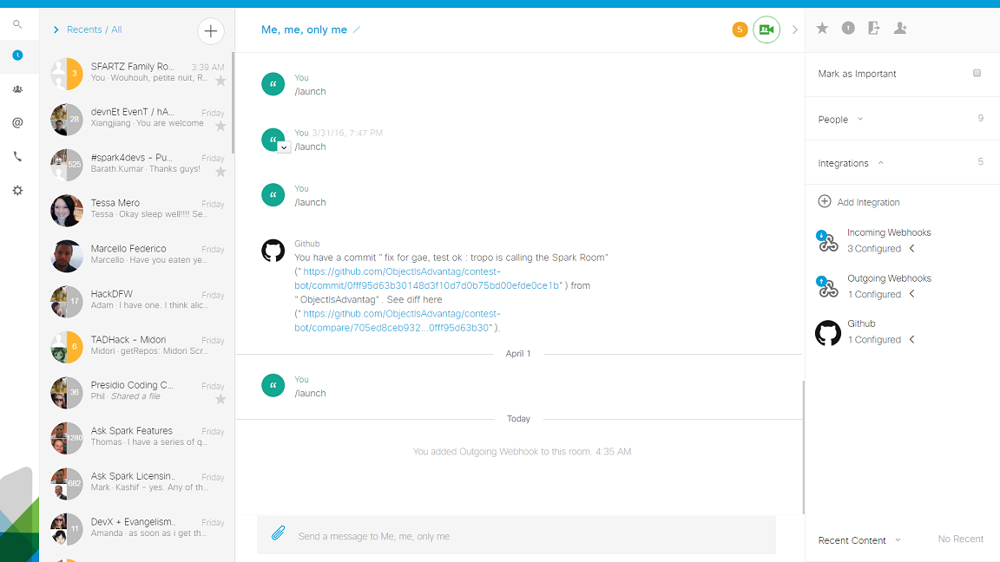

# Basic example of Outgoing integration

illustrates how to setup a Cisco Spark bot, and attached it to a Room as an Outgoing integration

Quick steps

1. Run the example

2. Expose your sparkbot to the internet

3. Attach it to a spark room

4. Write a message in the room you attached you bot


## Run the example

Open a shell, clone the current github repository if you did not do it yet, then type:

```
> cd examples
> node basic-integration.js
Cisco Spark bot started
Outgoing integration, running on port 8080
```

You can test your bot is running by hitting its health endpoint:

```
> curl -X GET http://localhost:8080/ping
{
 "message":"Congrats, your bot is up and running",
 "isWebhook":false,
 "isIntegration":true,
 "URI":"http://localhost:8080/"
}
```

You may also send fake new incoming message to your bot:

```
curl -X POST -H "Content-Type: application/json" \
      -d '{"text":"this sample illustrates an Outgoing integration", "personEmail":"stsfartz@cisco.com", "id":"Y2lz...","roomId":"Y2lz...","personId":"Y2lz...","created":"2016-04-11T23:19:32.413Z"}' \
      "http://localhost:8080/"

{"message":"message processed by integration"}
```


## Expose your sparkbot to the internet

You'll need a tunneling took such as ngrok, localtunnel

```
> npm install -g localtunnel
> lt -s mysparkbot -p 8080
your url is: https://mysparkbot.localtunnel.me
```


## Attach your sparkbot to a spark room

Launch the Cisco Spark Web client : https://web.ciscospark.com

Go to the right pane, locate the Integrations section, 

Select Add integration, scroll down and click the Outgoing integration 

Go through the wizard, choose a room and specify your bot endpoint: https://mysparkbot.localtunnel.me, 


## Test your bot

Write a message in the room you attached your bot to,

The bot should write to the console


```
> node basic-integration.js
Cisco Spark bot started
Outgoing integration, running on port 8080
Outgoing integration invoked
Processing message: {"id":"Y2lzY29zcGFyazovL3VzL01FU1NBR0UvZWYyMTZkYjAtMDNiOC0xMWU2LWI4MTktNzcwNzhmYWRlZTU4","roomId":"Y2lzY29zcGFyazovL3VzL1JPT00vMjQ4ZTQ3OTAtZWJjZi0xMWU1LTkyMjEtMTVmMTZiMmJlZjUx","text":"Completed the basic outgoing integration sample","personId":"Y2lzY29zcGFyazovL3VzL1BFT1BMRS85MmIzZGQ5YS02NzVkLTRhNDEtOGM0MS0yYWJkZjg5ZjQ0ZjQ","personEmail":"stsfartz@cisco.com","created":"2016-04-16T09:52:30.219Z"}
new message from stsfartz@cisco.com: Completed the basic outgoing integration sample
```
