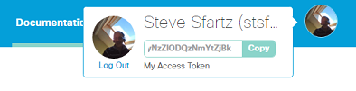
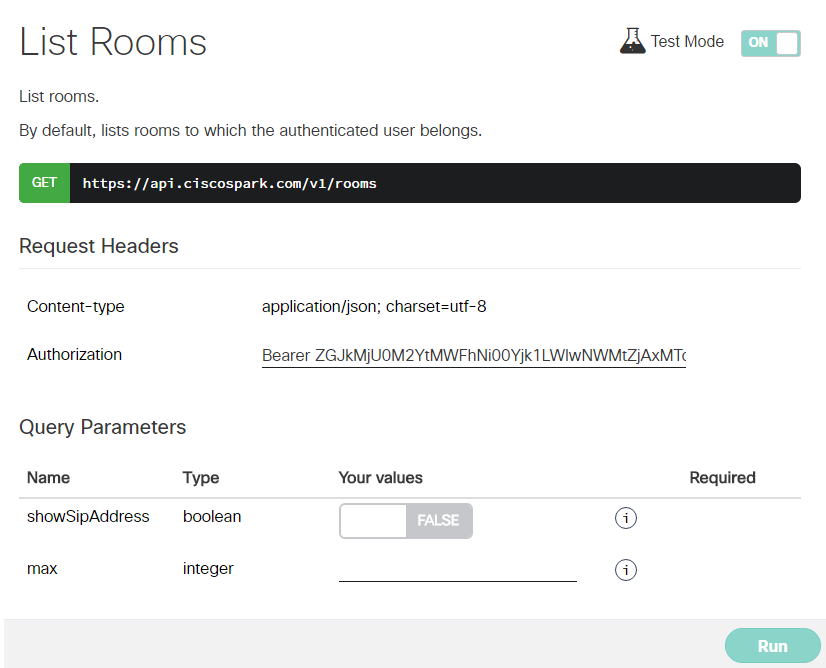
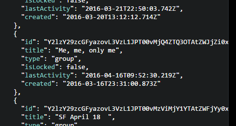
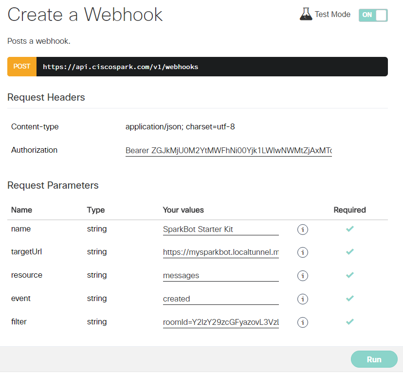
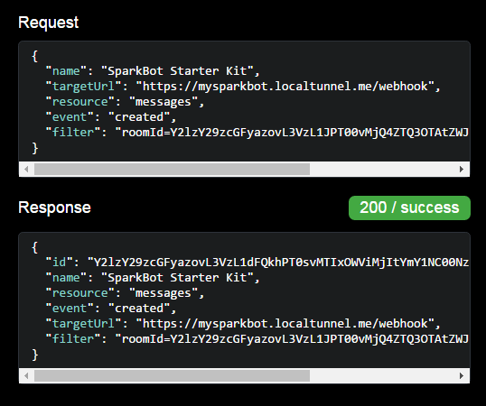

# Basic example of REST Webhook

illustrates how to setup a Cisco Spark bot, and attached it to a Room as a [REST Webhook](https://developer.ciscospark.com/webhooks-explained.html).

Quick steps:

1. Run the example

2. Expose your sparkbot to the internet

3. Attach your bot to a spark room

4. Write a message in the room you attached you bot


## Run the example

Retreive your API token can be retreived by clicking on your picture, in the upper right of the [Web Portal documentation](https://developer.ciscospark.com/getting-started.html#).



Open a shell, clone the current github repository if you did not do it yet, then type the commands below.

```
> cd examples
> SPARK_TOKEN=ZGJkMjU0M2YtMWFhNi00Yjk1LWIwNWMtZjAxMTczMDljMDQyNzZlODQzNmYtZjBk  node basic-webhook.js
Cisco Spark bot started
REST webhook, running on port 8080
```

You can test your bot is running by hitting its health endpoint:

```
> curl -X GET http://localhost:8080/ping
{
 "message":"Congrats, your bot is up and running",
 "isWebhook":true,
 "isIntegration":false,
 "URI":"http://localhost:8080/webhook"
}
```


## Expose your bot to the internet

You'll need a tunneling took such as [localtunnel](http://localtunnel.me) or [ngrok](https://ngrok.com).

```
> npm install -g localtunnel
> lt -s mysparkbot -p 8080
your url is: https://mysparkbot.localtunnel.me
```


## Attach your bot to a spark room

You can either use the [Spark interactive documentation](https://developer.ciscospark.com/resource-webhooks.html), 
or leverage your favorite REST client (curl, Postman...).

This guide leverages the interactive documentation.

First, we'll pick the id of the Room you want to attach to. Go to the [List Rooms page](https://developer.ciscospark.com/endpoint-rooms-get.html).



Toogle Test mode to on. Run the request, navigate to a Room from the list displayed in the right pane. Copy the id of the Room, here Y2lzY29zcGFyazovL3VzL1JPT00vMjQ4ZTQ3OTAtZWJjZi0xMWU1LTkyMjEtMTVmMTZiMmJlZjUx.



Then, go to the[ Webhook creation page](https://developer.ciscospark.com/endpoint-webhooks-post.html), and fill in the form.
Specify the targetUrl you chose when exposing your webhook, here https://mysparkbot.localtunnel.me/webhook.



Run the webhook creation, and check you get a 200 OK in the right pane:




## Test your bot

Write a message in the room you attached your bot to.

The bot should write to the console:

```
> SPARK_TOKEN=ZGJkMjU0M2YtMXXXX  node basic-webhook.js
Cisco Spark bot started
REST webhook, running on port 8080
REST webhook invoked
Asking for decrypted message
Received decrypted message, decoding
Processing message: {"id":"Y2lzY29zcGFyazovL3VzL01FU1NBR0UvNTRjZWUzZDAtMDNjZS0xMWU2LTkxMDktNjU5NWE3YzRkODU2","roomId":"Y2lzY29zcGFyazovL3VzL1JPT00vMjQ4ZTQ3OTAtZWJjZi0xMWU1LTkyMjEtMTVmMTZiMmJlZjUx","text":"completed to webhook sample","personId":"Y2lzY29zcGFyazovL3VzL1BFT1BMRS85MmIzZGQ5YS02NzVkLTRhNDEtOGM0MS0yYWJkZjg5ZjQ0ZjQ","personEmail":"stsfartz@cisco.com","created":"2016-04-16T12:25:40.237Z"}
New message from stsfartz@cisco.com: completed the basic webhook sample
```
